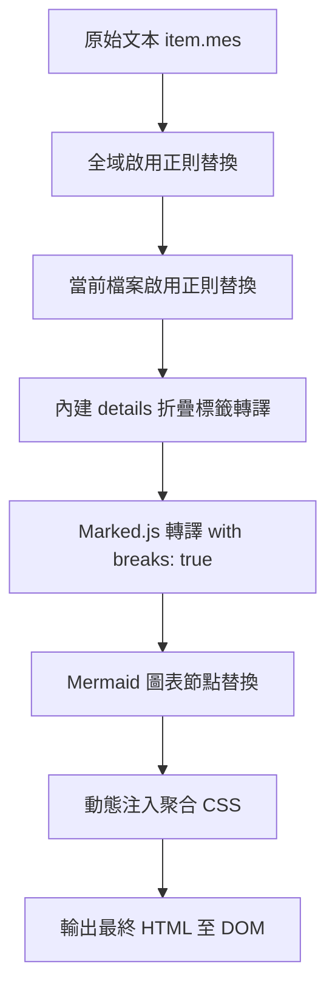

# JSONL-Viewer 系統需求與技術規格書 (System Specification Document)

> [!NOTE]
> 本文件為 **JSONL-Viewer (SillyTavern 特化版)** 之完整系統架構與技術規格書。本規格書詳盡記錄了系統架構、資料模型、轉譯管線、UI/UX 規範及雲端同步協議，可直接作為後續跨對話開發、功能擴充或重構之核心基準。

---

## 1. 專案概述與設計哲學 (Overview & Philosophy)

- **專案定位**：專為 SillyTavern（酒館）生態打造之純前端、單一檔案（Single-file SPA）輕量化聊天紀錄檢視、美化、編輯與匯出工具。
- **核心設計原則**：
  1. **零後端依賴**：完全於瀏覽器客戶端運行，保障使用者隱私，所有資料僅暫存於本地記憶體、`localStorage` 或使用者私有的 Google Drive 空間。
  2. **酒館原生相容**：1:1 還原酒館的換行邏輯、思考鏈、多選分支（Swipes）、雙軌 ID 追蹤與正則腳本系統。
  3. **極致效能**：透過 `IntersectionObserver` 虛擬增量渲染（分批載入），即便面對上萬筆對話、數十萬字長文本亦能保持 60 FPS 流暢捲動。
  4. **全端響應式 (RWD)**：電腦端雙欄工作流與手機/平板端自適應抽屜式導航，無縫適配不同尺寸螢幕。

---

## 2. 技術棧與外部依賴 (Tech Stack & CDNs)

| 類別 | 名稱 / 服務 | 版本 / 規格 | 用途說明 |
| :--- | :--- | :--- | :--- |
| **核心語言** | HTML5 / CSS3 / ES6+ JavaScript | 純原生標準 | 單一檔案即可直接以瀏覽器開啟運作 |
| **Markdown 解析** | Marked.js | `v12.0.0` (CDN) | 對話內文、特殊區塊與 Markdown 語法即時轉譯 |
| **圖表繪製** | Mermaid.js | `v10.8.0` (CDN) | 對話內流程圖、時序圖動態渲染 |
| **圖示庫** | Font Awesome | `v6.5.1` (CDN) | 提供介面圖示與品牌 Icon |
| **身分驗證** | Google Identity Services (GIS) | `client.js` (Google CDN) | OAuth 2.0 Token Client 授權登入 |
| **雲端 API** | Google Drive REST API | `v3` | 存取使用者私有 `appDataFolder` 隱藏空間 |

---

## 3. 核心資料模型 (Data Models & Schema)

### 3.1. 對話資料物件模型 (Chat Item Data Model)
系統載入 `.jsonl` 檔案後，各行 JSON 將被解析並補齊以下內部追蹤欄位：

```typescript
interface ChatMessageItem {
  // 原始欄位 (SillyTavern 原生)
  name?: string;               // 角色名稱
  is_user?: boolean;           // 是否為使用者發言
  mes?: string;                // 對話訊息本體 (支援 Markdown / HTML)
  send_date?: string | number; // 發送時間戳記
  model?: string;              // 模型名稱
  swipe_id?: number;           // 當前選取的分支 ID (預設 0)
  swipes?: string[];           // 多分支候選回覆陣列
  extra?: {                    // 酒館擴充中繼資料
    model?: string;
    api_model?: string;
    model_name?: string;
    swipes_info?: Array<{ model?: string; extra?: any }>;
    gen_metadata?: { model?: string };
  };

  // 系統計算之內部欄位
  _local_id: number;           // 酒館 ID：切檔後的相對樓層 (0, 1, 2...)
  _original_id: number;        // 總計 ID：切檔前保留的物理絕對樓層
}
```

### 3.2. 雙層正則與樣式管理資料模型 (Script Engine Schema v3)
儲存於 `localStorage` (`st_script_engine_v3`) 及 Google Drive (`st_character_presets.json`)：

```typescript
interface ScriptEngineDataV3 {
  version: 3;
  lastUpdated?: string;

  // 🌍 第 1 層：全域預設腳本 (Preset Scripts - 所有檔案共享)
  globalPresets: {
    [groupName: string]: {
      enabled: boolean;
      rules: Array<{
        id: string;            // 唯一識別碼，如 "rule_g_172450..."
        name: string;          // 規則名稱，如 "📊 Profile"
        enabled: boolean;      // 獨立開關 (true / false)
        findRegex: string;     // 尋找正則，如 "<profile>([\\s\\S]*?)</profile>"
        replaceString: string; // 替換 HTML 範本 (支援 $1, $2)
        customCss?: string;    // 該條目專屬 CSS 樣式
      }>;
    };
  };

  // 📁 第 2 層：區域檔案腳本 (Scoped Scripts - 依檔案名稱唯一綁定)
  fileScopedPresets: {
    [fileName: string]: {
      enabled: boolean;
      groups: {
        [groupName: string]: {
          enabled: boolean;
          rules: Array<{
            id: string;        // 唯一識別碼，如 "rule_f_172450..."
            name: string;
            enabled: boolean;
            findRegex: string;
            replaceString: string;
            customCss?: string;
          }>;
        };
      };
    };
  };
}
```

---

## 4. 文本處理與渲染管線 (Text & Rendering Pipeline)

訊息在輸出至 DOM 之前，必須依序通過以下 5 階段管線：



1. **第 1 階段：全域正則替換 (Global Rules)**：
   - 依序遍歷 `globalPresets` 中所有 `enabled === true` 的分組與條目。
   - 支援包含 Flags（如 `/pattern/gmi`）或純字串模式。
   - 提取替換範本中的 `$1, $2...` 並自動經由 `marked.parse` 清理包裹的 `<p>` 標籤。
2. **第 2 階段：區域檔案正則替換 (File-scoped Rules)**：
   - 依當前載入的檔案名稱 `currentFileName`，遍歷 `fileScopedPresets[currentFileName]` 中所有啟用的分組與條目。
3. **第 3 階段：內建標籤相容**：
   - 將標準 `<details>` 轉譯為具備酒館美化樣式之 `.special-block`。
4. **第 4 階段：Markdown 與換行解析**：
   - 使用 `marked.use({ breaks: true })` 將單次換行轉為 `<br>`，符合對話排版。
   - 識別 `*斜體*` 作為心聲並渲染為 `--thought-color`。
5. **第 5 階段：樣式聚合與注入 (`injectAllRuleStyles`)**：
   - 動態聚合所有啟用規則之 `customCss`，注入至 `<style id="st-dynamic-injected-css">`。

---

## 5. 核心模組功能規格 (Feature Specifications)

### 5.1. 雙軌 ID 追蹤與模型標籤 (Dual ID & Model Badging)
- **酒館 ID (`_local_id`)**：對話切檔後的相對樓層 ID，自 `0` 起跳。
- **總計 ID (`_original_id`)**：對話切檔前保留之絕對物理樓層順序，不受拆檔影響。
- **模型標籤 (Model Tag)**：
  - 深度解析 `item.swipe_info[swipeId]`、`item.extra.swipes_info`、`item.extra.model`、`item.gen_metadata` 等多層路徑。
  - 於 AI 樓層標頭自動顯示 `🤖 模型名稱` 徽章。

### 5.2. 雙層正則管理引擎 (Two-Layer Script Engine)
- **分組與開關控制**：支援分組全開/全關開關，與各條目微型切換開關 (`.toggle-switch`)。
- **Modal 編輯器**：
  - 獨立彈窗 (`#editRuleModal`) 編輯「條目名稱」、「尋找正則」、「替換 HTML 範本」與「專屬 CSS」。
  - 內建正則語法靜態預檢（防呆驗證）。
- **跨檔案一鍵複製 (Clone Profile)**：
  - 獨立彈窗 (`#cloneProfileModal`)，可從下拉選單挑選已有檔案設定，一鍵深拷貝其群組規則並重新派發唯一 ID。

### 5.3. 精準搜尋與 DOM 自動導航 (Precision Search & Auto-Expand)
- **三種搜尋範圍**：
  - `全部範圍 (all)`：全文搜尋。
  - `僅內文 (mes)`：利用 `TreeWalker` 動態排除所有 `<details>` 內部節點，防止隱藏區塊干擾。
  - `僅思考鏈 (reasoning)`：專注搜尋思考鏈。
- **自動展開機制**：跳轉至匹配字詞時，若目標位於收合之 `<details>` 內部，系統自動將其所有父級 `<details>` 設為 `open = true`，並透過 `scrollIntoView({ behavior: 'smooth', block: 'center' })` 精準置中。

### 5.4. Google Drive 雲端同步架構 (OAuth 2.0 & AppData)
- **授權協議**：Google Identity Services (GIS) Token Client 流程。
- **儲存位置**：使用者個人的隱藏應用程式空間 (`appDataFolder`)，一般硬碟檔案清單不可見，具備最高安全性與隔離性。
- **雲端檔案名稱**：`st_character_presets.json`。
- **雙向同步功能**：
  - **上傳 (Push)**：透過 Multipart Upload / Patch 建立或覆蓋雲端檔案。
  - **下載 (Fetch)**：自雲端抓取最新雙層腳本結構，覆寫本地並即時觸發介面重新渲染。

---

## 6. 介面佈局與響應式規格 (UI/UX & RWD)

### 6.1. 斷點與佈局模式 (Breakpoints)
- **電腦版 (`min-width: 701px`)**：
  - 側邊控制面板預設**展開**（可點擊 `▶ / ◀` 折疊）。
  - 頂端列：左側為自訂檔名按鈕（自動折行，最大寬度 `80vw`），右側為搜尋與操作工具列。
  - 訊息 Meta 標題列：橫向單行排列（樓層車票 ➔ 角色名稱/時間 ➔ 模型標籤 ➔ 操作按鈕）。
- **手機版 (`max-width: 700px`)**：
  - 側邊控制面板預設**收合**（抽屜式滑出，寬度自適應）。
  - 頂端列：檔名按鈕鎖定 `45vw`（超出截斷 `...`），右側配置純圖示按鈕（`🔍`, `⬆`, `⬇`, `☰`）。
  - 訊息 Meta 標題列：自適應雙排重構（第一排為 ID 車票與純圖示按鈕；第二排 100% 寬度顯示角色名稱與時間戳記）。

### 6.2. 主題與樣式變數 (CSS Custom Properties)
系統支援 `dark-theme`（預設）與 `light-theme` 雙主題切換：

```css
:root {
    --bg-color: #1e1e1e;
    --text-color: #e0e0e0;
    --message-bg: #2d2d2d;
    --sys-message-bg: #252526;
    --border-color: #404040;
    --meta-color: #888888;
    --accent-color: #4a90e2;
    --user-accent-color: #bc5bf5;
    --thought-color: #ff9800;
    --reasoning-bg: #22272e;
    --reasoning-border: #444c56;
    --details-bg: #262c36;
    --details-border: #3b4354;
    --content-font-size: 16px;
    --reasoning-font-size: 14px;
}
```

---

## 7. 檔案匯出規範 (Export Specifications)

1. **修改後 JSONL 匯出**：
   - 檔名格式：`${原始檔名}_edited_${YYYYMMDDHHmmss}.jsonl`。
   - 檔案格式：標準 UTF-8、換行符號 `\n` 分隔之 JSON Lines 檔案。
   - 欄位保真度：完整保留原始 JSON 所有元數據（含 `swipes`, `extra`, `gen_metadata` 等）。
2. **正則預設包 JSON 匯出**：
   - 檔名格式：`st_script_presets_v3_${Timestamp}.json`。
   - 格式：包含版本宣告 `version: 3` 之標準雙層結構 JSON。
